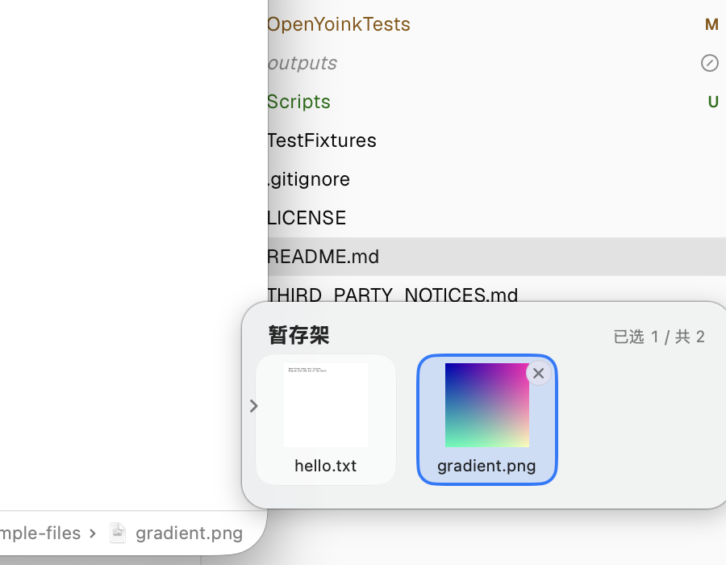
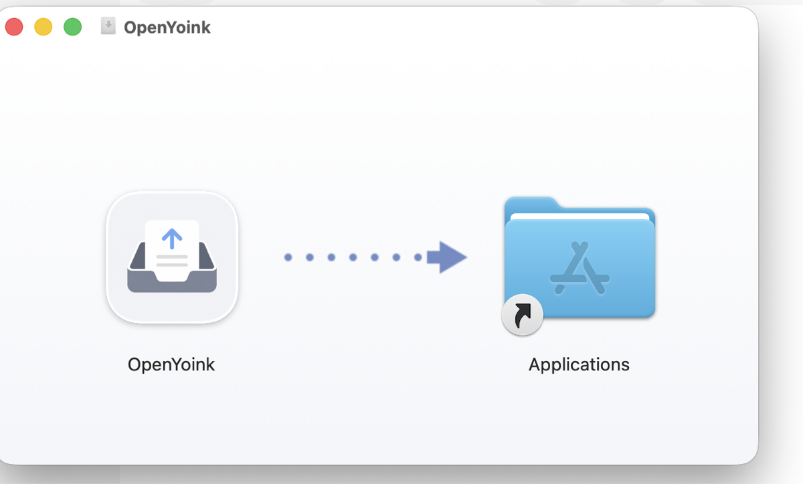

<p align="center">
  
</p>

<h1 align="center">OpenYoink</h1>

<p align="center">
  A native macOS drag-and-drop shelf — park files, text, images and links at the edge of your screen, then drop them wherever they need to go.<br>
  一个开源、原生的 macOS 拖拽暂存架：把文件、文本、图片、链接先放进屏幕边缘，再从容地拖到目标位置。<br>
  <a href="README.zh-Hans.md">中文文档</a> · <a href="#features">Features</a> · <a href="#install">Install</a> · <a href="#usage">Usage</a>
</p>

<p align="center">
  
  
  
  
</p>

<p align="center">
  
</p>

OpenYoink lives in your menu bar (no Dock icon). When you start dragging something, a compact shelf slides out at the edge of your screen — drop items onto it, navigate anywhere hands-free, then drag them out to their destination. It is an independent clean-room implementation inspired by the shelf pattern (see <a href="THIRD_PARTY_NOTICES.md">THIRD_PARTY_NOTICES</a>).

## Features

**Drag in — almost anything**
- Files & folders from Finder; images, text, rich text (HTML/RTF), links from browsers and other apps; file promises (e.g. Photos)
- Universal fallback: mail messages (.eml), calendar events (.ics), contacts (.vcf), and other data blobs are materialized into proper files
- Hold **⌘** while dropping to *move* the original into the shelf instead of referencing it (the original goes to the Trash, recoverable)

**Drag out — to anywhere**
- Dual file representation (`fileURL` + file promise) for maximum compatibility, including browser upload zones (best effort)
- Finder drops are always copies — your originals are never moved unless you used the ⌘ cut mode
- Multi-select and stacks drag out in one gesture

**Appears when you need it**
- Shows automatically when you start dragging (configurable: immediately / only near the screen edge / off)
- A small edge tab stays at the screen edge while the shelf is hidden — click to open, drop files onto it, drag it along the edge or to the other side
- Global hotkey (⌘⇧Space, customizable); double-press saves the clipboard into the shelf
- Optional mouse-shake trigger; per-app ignore list

**A shelf that stays out of the way**
- Compact height hugs its content; auto-hides when emptied
- Anchor left or right edge, or place it anywhere freely
- Collapse handle on the inner edge, hover ✕ on cards to remove items
- Quick Look (Space or double-click, multi-item), Open / Reveal in Finder / context menu
- Stacks, marquee selection, manual ordering, recent-items menu
- Multi-display, multi-Space and full-screen aware; English & 中文 UI

**Privacy first**
- App Sandbox, no network access, no Accessibility permission, no analytics — everything stays on your Mac

## Install

**Download** — grab `OpenYoink-x.y.dmg` from [Releases](https://github.com/MuQY1818/Open-Yoink/releases), open it, and drag OpenYoink to Applications:

<p align="center">
  
</p>

The build is ad-hoc signed (not notarized). On first launch, right-click the app and choose **Open**, or run:

```bash
xattr -dr com.apple.quarantine /Applications/OpenYoink.app
```

**Build from source** — requirements: macOS 26+, Xcode 26+.

```bash
git clone https://github.com/MuQY1818/Open-Yoink.git
cd Open-Yoink
open Open-Yoink.xcodeproj        # or build headless:
xcodebuild -project Open-Yoink.xcodeproj -scheme OpenYoink -destination 'platform=macOS' build
```

Leave `DEVELOPMENT_TEAM` empty to sign locally, or set your own team for distribution. `Scripts/make-dmg.sh` produces the DMG; `Scripts/notarize.sh` documents the notarization flow.

## Usage

| Action | How |
|---|---|
| Show / hide the shelf | ⌘⇧Space, menu-bar menu, or click the edge tab |
| Save clipboard to shelf | Double-press ⌘⇧Space |
| Add items | Drag anything onto the shelf (or onto the edge tab) |
| Move instead of reference | Hold ⌘ while dropping |
| Quick Look | Space or double-click a card |
| Remove an item | Hover ✕, Delete key, or context menu |
| Collapse the shelf | Click the chevron on the shelf's inner edge |
| Reposition | Drag the edge tab along the edge / to the other side, or use Settings → Position |

Settings (menu bar → Settings…): position & width, auto-hide behaviors, drag-out policy (keep / remove / ask), triggers (hotkey, drag reveal, mouse shake with three sensitivities), ignored apps, language.

## Architecture

SwiftUI renders; AppKit drives windows, drag & drop and global events.

```
Presentation  SwiftUI  ShelfView / Cards / Stacks / Settings / MenuBar
Windows & IO  AppKit   NSPanel shelf · EdgeTab · NSDraggingSource/Destination
                       QLPreviewPanel · Carbon hotkey · NSEvent monitors
Domain        Services ShelfStore (@Observable) · DropImportCoordinator
                       DragPayloadBuilder · BookmarkService · CutMoveService
Data          Models   ShelfItem (Codable) · JSON + security-scoped bookmarks
```

Key decisions: references over copies (⌘ cut mode aside), `NSFilePromiseProvider`-based dual representation for drag-out, atomic JSON persistence with debounce, security-scoped bookmarks for sandbox-safe file access, and a copy-only Finder policy so originals are never deleted.

## Testing

```bash
xcodebuild -project Open-Yoink.xcodeproj -scheme OpenYoink -destination 'platform=macOS' test
```

328 unit tests cover stores, persistence, bookmarks, payload building, pasteboard fallbacks, triggers and layout. `TestFixtures/` ships sample files and `upload-test-page.html` for manual drag-out checks against Safari / Chrome / Firefox.

## Roadmap

- **v2** — clipboard history (opt-in, with privacy filters)
- **v3** — Handoff & Continuity Camera, system extensions (Services / Quick Action / Share / Shortcuts)

Out of scope by design: cloud sync, auto-deleting user files, "every website upload guaranteed".

## Contributing

Issues and PRs are welcome. Please keep the architecture conventions (AppKit owns drag & drop and panels; pure logic stays unit-testable) and run the test suite before submitting.

## Acknowledgments

OpenYoink is a clean-room implementation. It studied publicly observable behavior of several MIT-licensed open-source shelf apps — no third-party code or assets are included. "Yoink" is a product of Eternal Storms Software; OpenYoink is independent and unaffiliated. See [THIRD_PARTY_NOTICES.md](THIRD_PARTY_NOTICES.md) for the full record.

## License

[MIT](LICENSE) © 2026 weijue
